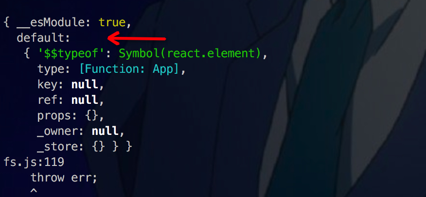

# react-ssr
简单的react开发环境搭建

服务端渲染

开发环境的服务端渲染

---
## 第一次提交
**最基础的react项目工程化搭建**

*目录结构*

```
  - build
    webpack.base.js
  - client
    - views
      App.jsx
    app.js
    tpl.html
```
- .babelrc中
```
{
  "presets": [
    ["es2015", {"loose": true}],
    "react"
  ]
}
```

*需要安装的包*

```
"dependencies": {
  "react": "^16.4.2",
  "react-dom": "^16.4.2",
  "webpack": "^3.10.0"
},
"devDependencies": {
  "@babel/core": "^7.0.0",
  "babel-core": "^6.26.3",
  "babel-loader": "^7.1.5",
  "babel-preset-es2015": "^6.24.1",
  "babel-preset-es2015-loose": "^8.0.0",
  "babel-preset-react": "^6.24.1",
  "html-webpack-plugin": "^3.2.0",
  "rimraf": "^2.6.2"
}
```

*package.json中写的运行的命令*

`rimraf` 清除每次`dist`目录下生成的文件


```
"scripts": {
  "test": "echo \"Error: no test specified\" && exit 1",
  "clean": "rimraf dist",
  "build:client": "webpack --config build/webpack.base.js",
  "build": "npm run clean && npm run build:client"
},
```

## 第二次提交

**webpack-dev-server**

增加webpack-dev-server之后，可以实现自动刷新，原因是：

支持两种自动刷新模式：

· `iframe mode`

· `inline mode` （默认是这种模式）

*这里重点说一下inline mode这种模式*

1、构建消息在浏览器控制台显示。

2、`socket.io`的`client`代码被打包进了你的包(bundle)中，以此来与`webpack-dev-server`进行`websocket`通讯，从而完成自动编译打包、页面自动刷新的功能。

3、但是，每一个入口文件都会被插入上述的一段脚本，使得打包后的bundle文件很臃肿。


`webpack-dev-server: ^2.9.7` 不要高于这个版本，否则会报错

## 第三次提交

模块热更新和webpack-dev-server自动刷新的区别

*react hot loader官方解释*

>React Hot Loader is a plugin that allows React components to be live reloaded without the loss of state. It works with Webpack and other bundlers that support both Hot Module Replacement (HMR) and Babel plugins.

模块热更新后state不会丢失，但是不同的webpack-dev-server相当于浏览器清除缓存的的刷新，state是不会保存的

*模块热更新新增的重要代码*

- webpack.config.client.js中
```
config.plugins.push(new webpack.HotModuleReplacementPlugin())

devServer中增加配置项
hot: true
```
- .babelrc中
```
"plugins": [
  "react-hot-loader/babel"
]
```
- app.js中
```
import { AppContainer } from 'react-hot-loader'

if (module.hot) {
  module.hot.accept('./views/App', () => {
    const nextApp = require('./views/App').default
    render(nextApp)
  })
}
```

用`webpack-dev-server`启动的时候，一定要将根目录下的`dist`目录删除，否则，`webpack`就会直接去找到这个文件

## 第四次提交

*基本服务端渲染*

思路就是，node拿到html内容直接返回给前端，注意：服务端渲染的时候，`dist`文件中的内容都要提前生成好，也就是说要执行以下命令：

```
"build:client": "webpack --config build/webpack.config.client.js",
"build:server": "webpack --config build/webpack.config.server.js",
```
这样之后会生成`dist`目录已经相关的内容，然后

```
"dev:server": "node server/server.js",
```

localhost:8888启动，可以看到效果

```
const app = express()

const serverEntry = require('../dist/server-entry').default
const template = fs.readFileSync(path.join(__dirname, '../dist/index.html'), 'utf-8')
console.log(12, template)
app.use('/public', express.static(path.join(__dirname, '../dist')))
app.get('*', function (req, res) {
  const appString = ReactSSR.renderToString(serverEntry)
  console.log(16, appString)
  res.send(template.replace('<!--app-->', appString))
})
```

## 第五次提交

*开发环境下查看服务端渲染的效果*

第四次提交的时候，因为需要拿到生成的`html`返回，所以需要`build`编译之后才能看到相关的服务端渲染，现在我想在开发过程中，在用`webpack-dev-server`启动的时候也能实时的看到服务端渲染的效果，怎么做呢？

在`server`目录下添加了`dev-static.js`文件，其中是拿到`webpack-dev-server`生成的资源文件的相关代码，因为我们知道`webpack-dev-server`生成的代码是不存到硬盘上的，也就是不会像我们`build`的时候生成一个`dist`目录，这样之后，在`package.json`中，添加命令：

```
"dev:server": "cross-env NODE_ENV=development node server/server.js",
```

这样也就一次执行，以下两个命令就可以看到相关`webpack-dev-server`时候的服务端渲染效果了：

```
"dev:client": "cross-env NODE_ENV=development webpack-dev-server --config build/webpack.config.client.js",
"dev:server": "cross-env NODE_ENV=development node server/server.js",
```

就需用想第四次提交的时候写的那样，先`build`，在`npm run dev:server`了

## 小记

webpack打包的机制是loader的机制，webpack通过loader处理某一种资源
`npm init`的时候，keywords 是如果发npm包的时候，别人会根据keywords来进行搜索
从入口文件开始，会根据入口文件的依赖关系，一层一层的迭代下去之后，把整个js形成的依赖树，整体打包成一个js文件

用babel-loader 前也要装 babel-core 因为loader只是一个插件，并不包含`babel`的核心代码
babel默认是编译es6的代码，而不能支持jsx，怎么让他支持呢？这里根目录新建`.babelrc`
因为现在js的版本特别多，`babel-core`中是没有包含这么多版本的，所以要自己指定版本，这里就是在`.babelrc`中指定`presets`的配置了
```
  "presets": [
    ["es2015", {"loose": true}],
    "react"
  ]
```
做服务端渲染使用的是react-dom/server提供的奖react组件渲染成HTML的方法

因为服务度的node环境中是没有document的，所以不能直接用app.js 所以要新建一个server.entry.js，这里面只需要把服务端需要渲染的东西export出去就可以了，但是这是jsx代码，node环境还是没法执行的
所以还是要打包一下webpack.config.server.js

路径不写全，或者不写相对路径，会默认去node_modules下面去找

`require('../dist/server-entry')` 打印的效果如下：



因为`server.entry.js`中是`export default <App />`, 如果：

```
export const app = App
import { app } from 'app'

所以，如果是 export default app，所以在node中，require的是export出来的东西，也就是default包裹的
```

服务端渲染的时候，服务端读取的html文件是dist文件中的html，也就是服务端打包生成的html
